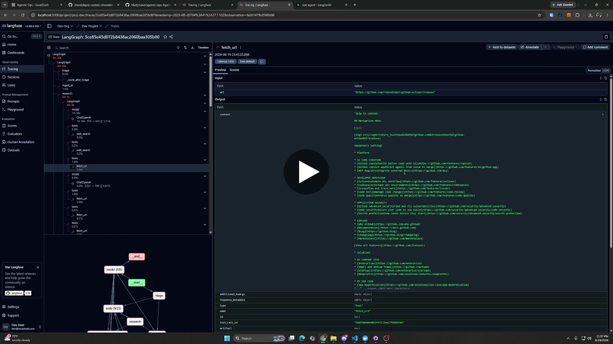
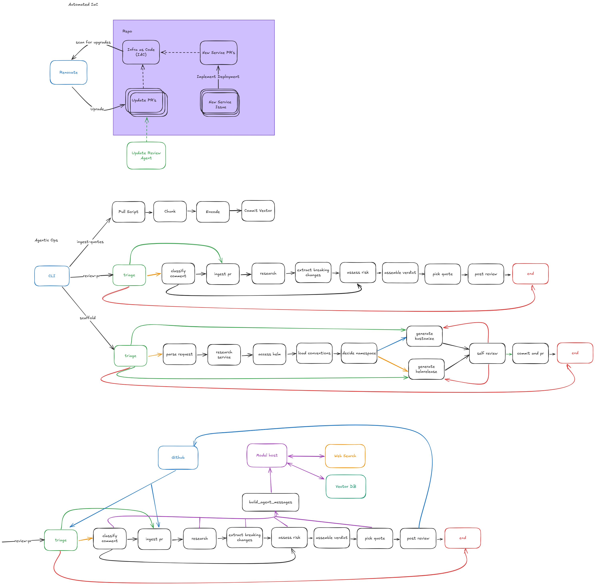

# ops-agent

> **AI-assisted development.** This repository was written with AI assistance:
> - Opus 5 / Sonnet 5 — architecture and planning
> - Deepseek 4 Flash — primary implementor
> - Qwen 38 27b — linting and test validation
> - Sonnet 5 — general bug fixes
>
> All code is reviewed, validated, and tested by a human.

An agentic ops pipeline for a self-hosted homelab. Two LangGraph graphs share a common set of tools and personas to automate two recurring ops tasks:

1. **Renovate PR reviewer** — annotates dependency-bump PRs opened by Renovate with breaking-change findings extracted from changelogs and release notes, then posts a verdict comment on the GitHub PR.
2. **Deployment scaffolder** — takes a natural-language service request, researches the service, generates Flux `HelmRelease` or Kustomize manifests following your existing repo conventions, self-reviews them, and opens a GitHub PR.

Renovate's Merge Confidence rating remains the primary auto-merge gate. This agent is a **veto and annotation layer on top** — it cannot merge PRs, only comment on them.

---

## Architecture

### Graph diagram

[](https://drive.google.com/file/d/1kZ8I4UIAB4gspIPD-i85_THcqaCHXrFp/view?usp=sharing)



```
ops-agent/
  llm/personas.py       # One model, four sampling-param bundles (research / coding / extract / instruct)
  tools/
    search.py           # SearXNG web search
    fetch.py            # URL fetcher → markdown text
    github.py           # GitHub REST client
  graphs/
    update_review/      # Graph A — PR annotation pipeline nodes + graph
    service_deploy/     # Graph B — manifest generation pipeline nodes + graph
  cli.py                # `ops-agent` entry point
```

**Personas are sampling parameters, not model aliases.** There is one model, configured via `LLM_MODEL` (or the legacy `MODEL_ALIAS`). A persona is a bundle of `temperature`, `top_p`, `top_k`, `presence_penalty`, and `enable_thinking` passed per-request:

| Persona   | `enable_thinking` | Use                                 |
|-----------|-------------------|-------------------------------------|
| `research`  | True              | Web search, evidence gathering      |
| `coding`    | True              | Manifest generation                 |
| `extract`   | False             | Structured extraction, self-review  |
| `instruct`  | False             | Parsing, formatting, posting        |

Extraction nodes never fabricate — each `Finding` requires a verbatim quote tied to a source URL. There are no confidence scores.

---

## Design notes

**Veto, not merge, for Graph A.** Renovate's Merge Confidence rating stays the primary auto-merge gate. Graph A can only comment and (where GitHub allows it) approve — it can never merge or block a PR outright. Dependency bumps are exactly the kind of change where a wrong auto-action is expensive and a wrong comment is cheap, so the agent's authority is scoped to match that asymmetry.

**Personas are sampling params, not model swaps.** One model, four parameter bundles (`research` / `coding` / `extract` / `instruct`, see table above). Extraction and formatting run with `enable_thinking=False` since they're bounded transformations, not open-ended reasoning — this keeps latency down on the steps that run most often without touching model choice.

**Self-review retry loop on Graph B**, not single-shot generation. Manifest generation self-reviews its own output against the target repo's existing conventions and retries up to twice before opening a PR. Generation-then-critique caught more convention drift in testing than trying to get the prompt right on the first pass.

**Postgres-backed checkpointing.** Both graphs compile with a `langgraph-checkpoint-postgres` checkpointer, so a crashed or interrupted run (a flaky GitHub API call mid-PR, a restart) resumes from its last completed node instead of restarting from scratch.

**The RAG feature quotes the Bee Movie script.** `pick_quote` (in Graph A) runs real retrieval — a Chroma vector store, `langchain-text-splitters` chunking, and OpenAI embeddings — over the Bee Movie script, and appends the closest-matching line to posted PR comments. This is a deliberate choice, not a placeholder: it's a legitimate excuse to show the retrieval mechanics (ingest → chunk → embed → similarity search) end-to-end without pretending a dependency-bump reviewer needs a "knowledge base" to know what SemVer is. It's gated behind `PR_QUOTE_ANNOTATIONS_ENABLED` and fails silently (falls back to no quote) if the vector store is unreachable, so it never blocks the actual review.

---

## Prerequisites

All external services must be running before you start the agent.

| Service | Role | Notes |
|---------|------|-------|
| **LLM endpoint** | Model inference | Any OpenAI-compatible `/v1` server (llama.cpp, vLLM, Ollama, OpenRouter, Groq, ...); configured via `LLM_BASE_URL` / `LLM_API_KEY` / `LLM_MODEL` |
| **SearXNG** | Web search | Self-hosted, reachable over HTTP |
| **GitHub** | Git forge | github.com; agent needs a fine-grained PAT |
| **Renovate** | Dependency update bot | Must be configured to open PRs against your GitHub repos |
| **Flux** | GitOps runtime | Required if you use Graph B for HelmRelease-based deployments |

Python ≥ 3.11 and [uv](https://docs.astral.sh/uv/) are required on the machine running the agent.

You'll also need an **IaC/GitOps repo** with Renovate (or another auto-updating
bot) configured to open dependency-bump PRs — that's what Graph A reviews and
Graph B commits scaffolded manifests into. If you don't have one handy, you can
point the agents at [MattyIceee/test-deployment](https://github.com/MattyIceee/test-deployment)
to try things out.

---

## Setup

```bash
# 1. Clone and enter the repo
git clone https://github.com/MattyIceee/agentic-ops.git
cd agentic-ops

# 2. Install dependencies
uv sync

# 3. Configure
cp .env.example .env
$EDITOR .env   # fill in the required fields (see Environment variables below)
```

### Environment variables

Copy `.env.example` to `.env` and set:

| Variable | Required | Default | Description |
|----------|----------|---------|-------------|
| `LLM_PROVIDER` | No | `llamacpp` | Provider profile: `llamacpp` (sends top_k / thinking extensions) or `openai-compatible` (standard params only) |
| `LLM_BASE_URL` | No | `http://localhost:8080/v1`¹ | Base URL of the OpenAI-compatible endpoint (llama.cpp, vLLM, Ollama, OpenRouter, ...) |
| `LLM_API_KEY` | No | `sk-no-auth`¹ | API key — llama.cpp ignores auth, cloud providers need a real key |
| `LLM_MODEL` | No | `qwen3.6-a3b`¹ | Model name as served by the endpoint |

¹ Fall back to the legacy `LLAMACPP_BASE_URL` / `LLAMACPP_API_KEY` / `MODEL_ALIAS` variables when unset.
| `SEARXNG_URL` | **Yes** | `http://localhost:8081` | Base URL of your SearXNG instance (matches the docker-compose stack) |
| `GITHUB_API_BASE_URL` | No | `https://api.github.com/` | Base URL of the GitHub REST API |
| `GITHUB_BASE_URL` | No | `https://github.com` | Git clone host for pushing branches and opening PRs |
| `GITHUB_TOKEN` | **Yes** | — | GitHub fine-grained PAT with repo read/write scope |
| `GIT_AUTHOR_NAME` | No | `ops-agent` | Git commit author name |
| `GIT_AUTHOR_EMAIL` | No | `ops-agent@homelab.local` | Git commit author email |
| `TRUSTED_GITHUB_LOGINS` | No | — | Comma-separated GitHub logins whose PR comments/reviews may steer (re-drive) the graphs. Empty = no one may steer. |
| `STEERING_TRUSTED_ONLY` | No | `true` | Only trusted logins may re-trigger work; untrusted comments are ignored by the graphs. |
| `REQUEST_TIMEOUT_SECONDS` | No | `120` | HTTP timeout for all outbound requests |

### GitHub token

Create a **fine-grained personal access token** scoped to the repos the agent works on,
with these repository permissions:

| Permission | Access |
|---|---|
| Contents | Read and write |
| Pull requests | Read and write |
| Issues | Read and write |
| Metadata | Read |

Note that GitHub rejects (422) any attempt to approve a PR opened by the token's own
account. Graph A's auto-approve therefore works on Renovate PRs (authored by
`renovate[bot]`) but will warn and skip if the agent reviews a PR it opened itself.

---

## Running

### Graph A — Review a Renovate PR

```bash
uv run ops-agent review-pr --owner <github-owner> --repo <repo-name> --pr <pr-number>
```

The agent will:
1. Fetch the PR diff and metadata from GitHub.
2. Search the web for changelogs and release notes.
3. Extract breaking-change findings (verbatim quotes only).
4. Assemble a verdict (`clear` / `breaking` / `needs_human`).
5. Post a markdown comment on the GitHub PR.

### Graph B — Scaffold a deployment

```bash
# Inline prompt
uv run ops-agent scaffold --prompt "Deploy Paperless-NGX with a PostgreSQL backend, port 8000"

# Or from a file
uv run ops-agent scaffold --prompt-file request.txt
```

The agent will:
1. Parse the request into a service spec.
2. Research the service (image, ports, env, volumes).
3. Check for an upstream Helm chart on Artifact Hub.
4. Read your target GitOps repo (`--owner`/`--repo`, or set in state) for Kustomize/Flux conventions.
5. Generate a `HelmRelease` + `values.yaml` (if a chart exists) or Kustomize manifests.
6. Self-review against your conventions; retry up to 2 times if issues are found.
7. Create a branch, commit the manifests, push, and open a GitHub PR.

---

## Tests

```bash
uv run pytest -q
```

Tests run without a live model or network — LLM calls and HTTP are mocked.

---

## Evals

Evals measure breaking-change extraction precision/recall against labeled past Renovate PRs.

```bash
uv run python -m evals.runner
```

`evals/data/` ships with 7 labeled examples (axios, eslint, express, lodash, node-fetch, react, requests) — real changelog evidence paired with a `has_breaking_change` ground-truth label. The runner replays each example's stored evidence through the same `extract_breaking_changes` node Graph A uses in production, then prints a per-example comparison table plus precision/recall/F1 against the ground truth. Drop additional labeled JSON files into `evals/data/` following the schema documented in [evals/README.md](evals/README.md) to grow the set — if the directory is ever emptied, the runner prints `no eval data yet` and exits 0 rather than failing.

---

## Langfuse Tracing (Local Development)

Langfuse v3 provides distributed tracing for graph executions. A full Docker stack is included for local testing.

### Start the stack

```bash
docker compose down -v  # Clean start
docker compose up -d
```

All services will be healthy in ~30 seconds:
- **Langfuse Web UI**: http://localhost:3000
- **MinIO S3 console**: http://localhost:9091
- **SearXNG**: http://localhost:8081

Point `SEARXNG_URL` at `http://localhost:8081` to use the bundled SearXNG
instance (the JSON API needed by the `web_search` tool is enabled).

### Default credentials

| Service | Username | Password |
|---------|----------|----------|
| Langfuse | `dev@localhost.com` | `changeme` |
| MinIO | `minioadmin` | `minioadmin` |

### Enable tracing in ops-agent

Update `.env`:
```
LANGFUSE_ENABLED=true
LANGFUSE_SECRET_KEY=sk-lf-dev-test-key-12345678901234567890ab
LANGFUSE_PUBLIC_KEY=pk-lf-dev-test-key-12345678901234567890ab
LANGFUSE_BASE_URL=http://localhost:3000
```

### Run a traced execution

```bash
uv run ops-agent review-pr --owner test --repo test --pr 1
```

Traces will appear in Langfuse Web UI with:
- Trace name: `update-review/test/test#1`
- Tags: `graph:update-review`, `has-findings` (if applicable)
- Metadata: dependency, version bump, verdict, finding count
- Spans: one per node, with LLM latency visible

---

## Development

```bash
# Lint
uv run ruff check src/ tests/

# Format
uv run ruff format src/ tests/
```

---

## What I'd improve with more time

- **Eval coverage for Graph B.** The labeled dataset only covers Graph A's breaking-change extraction; the deployment scaffolder has no equivalent — e.g. golden manifests to diff generated `HelmRelease`/Kustomize output against.
- **Redact secrets/PII before they're quoted back.** Fetched changelog and release-note text flows into posted PR comments unfiltered. Fine for public OSS changelogs today, but not safe as-is if pointed at private feeds.
- **One-command bootstrap.** A Makefile or setup script wrapping `uv sync` + `docker compose up -d` + `.env` scaffolding, so getting a fresh checkout running is one command instead of reading the Setup section top to bottom.
- **A second, domain-relevant RAG corpus.** The Bee Movie retrieval demonstrates the mechanics; pairing it with a "serious" one (e.g. this org's own deployment conventions or changelog-writing style) would show the same pipeline solving an actual problem, not just a fun one.
